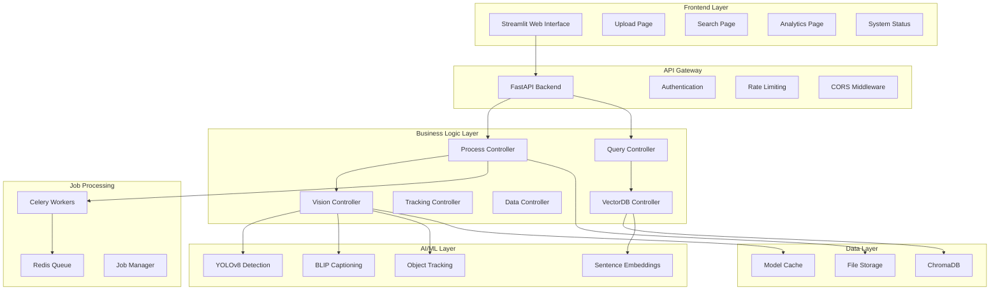
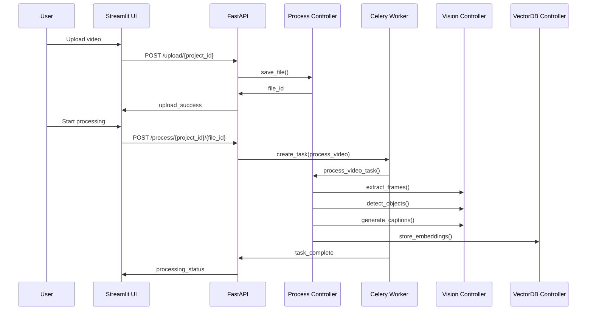
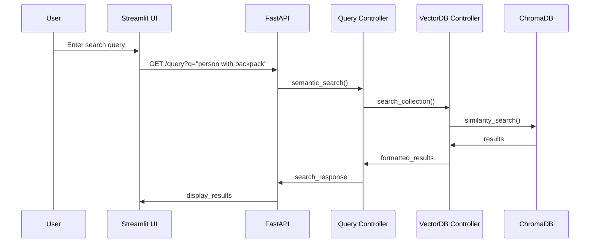
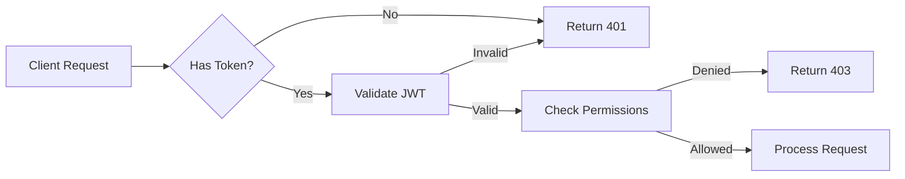

# 🏗️ System Architecture

This document provides a comprehensive overview of the Intelligent Surveillance System architecture, component interactions, and design principles.

## 🎯 High-Level Architecture



## 🏛️ Component Architecture

### 1. Frontend Layer (Streamlit)

**Purpose**: User interface and interaction layer

**Components**:
- `app.py` - Main application entry point
- `pages/1_📤_Video_Processing.py` - Video upload and processing interface
- `pages/2_🔍_Semantic_Search.py` - Natural language search interface
- `pages/3_📊_Analytics.py` - Analytics and metrics dashboard
- `pages/4_⚙️_System_Status.py` - System health monitoring
- `utils/api_client.py` - Backend API communication

**Key Features**:
- Multi-page navigation
- Real-time status updates
- Interactive data visualization
- File upload handling
- Responsive design

### 2. API Gateway (FastAPI)

**Purpose**: HTTP API server and request routing

**Components**:
- `main.py` - Application entry point and configuration
- `routes/surveillance.py` - Core surveillance API endpoints
- `routes/data.py` - Data management endpoints
- `routes/base.py` - Basic health and utility endpoints
- `services/auth.py` - Authentication and authorization
- `services/job_queue.py` - Background job management

**Key Features**:
- Automatic API documentation (OpenAPI/Swagger)
- JWT authentication
- Rate limiting
- CORS handling
- Request validation
- Error handling

### 3. Business Logic Layer (Controllers)

**Purpose**: Core business logic and orchestration

#### Process Controller (`ProcessController.py`)
- Orchestrates video processing workflows
- Manages frame extraction and analysis
- Coordinates AI model execution
- Handles processing job lifecycle

#### Vision Controller (`VisionController.py`)
- Integrates AI models (YOLO, BLIP)
- Performs object detection and tracking
- Generates scene captions
- Manages model loading and caching

#### Query Controller (`QueryController.py`)
- Handles semantic search requests
- Processes search filters and parameters
- Formats search results
- Manages search analytics

#### Vector Database Controller (`VectorDBController.py`)
- Manages ChromaDB interactions
- Handles vector embeddings
- Performs similarity searches
- Maintains data consistency

#### Data Controller (`DataController.py`)
- Manages file operations
- Handles project organization
- Validates data integrity
- Provides data access abstractions

### 4. AI/ML Layer

**Purpose**: Artificial intelligence and machine learning capabilities

**Components**:
- **YOLOv8**: Real-time object detection
- **BLIP**: Scene captioning and description
- **Object Tracking**: Multi-object tracking across frames
- **Sentence Transformers**: Text embedding generation

**Integration Pattern**:
```python
# AI processing pipeline
def process_frame(frame_path):
    # 1. Object detection
    detections = yolo_model.detect(frame_path)
    
    # 2. Object tracking  
    tracked_objects = tracker.update(detections)
    
    # 3. Scene captioning (selective)
    if is_key_frame(detections):
        caption = blip_model.caption(frame_path)
        embedding = embedder.encode(caption)
    
    return ProcessingResult(detections, tracked_objects, caption, embedding)
```

### 5. Job Processing Layer

**Purpose**: Asynchronous background processing

**Components**:
- **Celery Workers**: Distributed task execution
- **Redis**: Message broker and result backend
- **Job Manager**: Task scheduling and monitoring

**Job Types**:
- Video processing tasks
- Frame analysis jobs
- Bulk data operations
- Cleanup and maintenance

### 6. Data Layer

**Purpose**: Data persistence and retrieval

**Components**:
- **ChromaDB**: Vector database for semantic search
- **File Storage**: Video files and extracted frames
- **Model Cache**: AI model storage and caching
- **Metadata Storage**: Processing results and analytics

## 🔄 Data Flow Patterns

### 1. Video Processing Flow



### 2. Search Flow



## 🔧 Design Principles

### 1. Modularity
- **Separation of Concerns**: Each component has a specific responsibility
- **Loose Coupling**: Components interact through well-defined interfaces
- **High Cohesion**: Related functionality is grouped together

### 2. Scalability
- **Horizontal Scaling**: Add more Celery workers for increased throughput
- **Vertical Scaling**: Optimize resource usage within components
- **Stateless Design**: Controllers can be easily replicated

### 3. Reliability
- **Error Handling**: Comprehensive error handling at all layers
- **Graceful Degradation**: System continues operating with reduced functionality
- **Data Consistency**: Transactional operations where needed

### 4. Performance
- **Asynchronous Processing**: Non-blocking operations for better responsiveness
- **Caching**: Model and data caching for faster access
- **Optimized Queries**: Efficient database operations

### 5. Maintainability
- **Clear Structure**: Logical organization of components
- **Documentation**: Comprehensive code and API documentation
- **Testing**: Unit and integration tests

## 🚀 Deployment Architecture

### Development Environment
```
┌─────────────┐  ┌─────────────┐  ┌─────────────┐
│  Streamlit  │  │   FastAPI   │  │   Redis     │
│  :8501      │  │   :5000     │  │   :6379     │
└─────────────┘  └─────────────┘  └─────────────┘
       │                │                │
       └────────────────┼────────────────┘
                        │
              ┌─────────────┐
              │   Celery    │
              │   Worker    │
              └─────────────┘
```

### Production Environment
```
┌─────────────┐    ┌─────────────────┐    ┌─────────────┐
│  Streamlit  │    │   Load Balancer │    │   FastAPI   │
│   Cloud     │────│    (nginx)      │────│   Cluster   │
└─────────────┘    └─────────────────┘    └─────────────┘
                            │                     │
                   ┌─────────────┐       ┌─────────────┐
                   │   Redis     │       │   Celery    │
                   │  Cluster    │       │  Workers    │
                   └─────────────┘       └─────────────┘
                            │                     │
                   ┌─────────────────────────────────┐
                   │        ChromaDB + Storage       │
                   └─────────────────────────────────┘
```

## 🔒 Security Architecture

### Authentication Flow


### Security Layers
1. **Transport Security**: HTTPS/TLS encryption
2. **Authentication**: JWT token validation
3. **Authorization**: Role-based access control
4. **Rate Limiting**: Request throttling
5. **Input Validation**: Request sanitization
6. **File Security**: Upload validation and sandboxing

## 📊 Performance Characteristics

### Throughput Metrics
- **Video Upload**: 100MB/min over standard connection
- **Frame Processing**: 30-60 FPS on CPU, 100+ FPS on GPU
- **Search Queries**: <500ms response time
- **Concurrent Users**: 10+ simultaneous processing jobs

### Resource Requirements
- **CPU**: 4+ cores recommended
- **Memory**: 8GB+ for AI models
- **Storage**: SSD recommended for video processing
- **Network**: 100Mbps+ for video uploads

## 🔮 Future Architecture Enhancements

### Planned Improvements
1. **Microservices**: Break down into smaller, independent services
2. **Event Sourcing**: Implement event-driven architecture
3. **CQRS**: Separate read and write operations
4. **GraphQL**: Flexible API query language
5. **Kubernetes**: Container orchestration for scaling
6. **Streaming**: Real-time video processing capabilities

### Scaling Strategies
1. **Database Sharding**: Distribute data across multiple databases
2. **CDN Integration**: Global content delivery
3. **Auto-scaling**: Dynamic resource allocation
4. **Edge Computing**: Distribute processing closer to users

---

**Last Updated**: July 2025  
**Architecture Version**: 2.0  
**Review Cycle**: Quarterly
